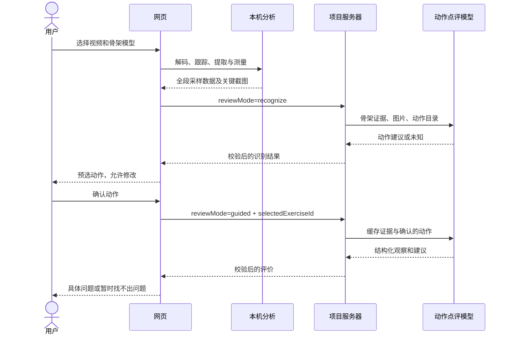
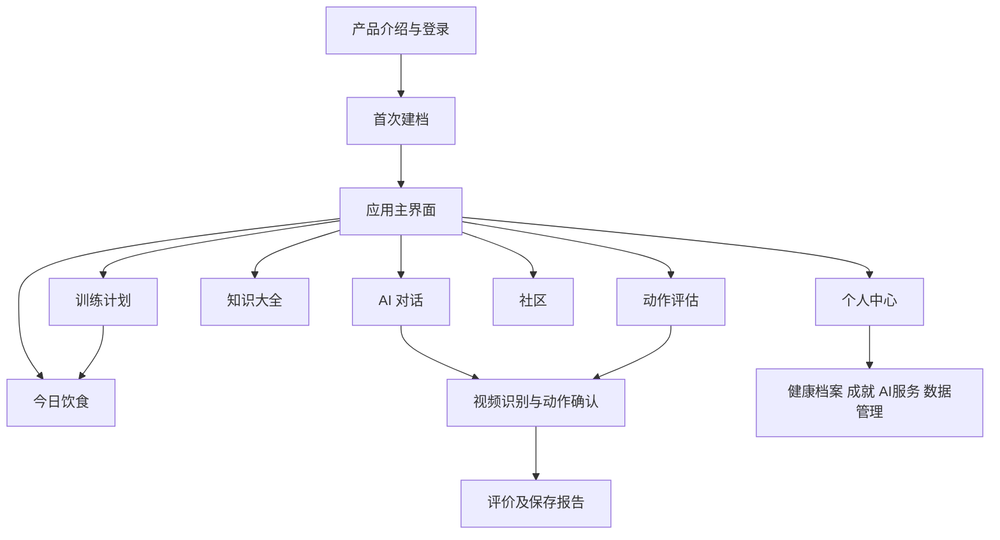
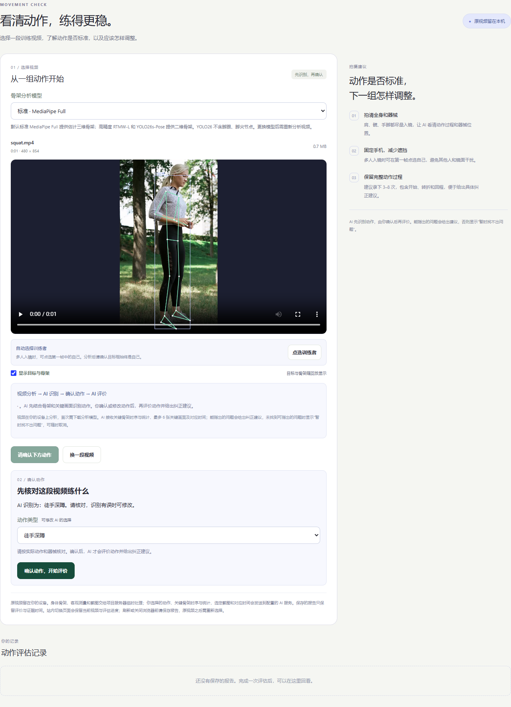
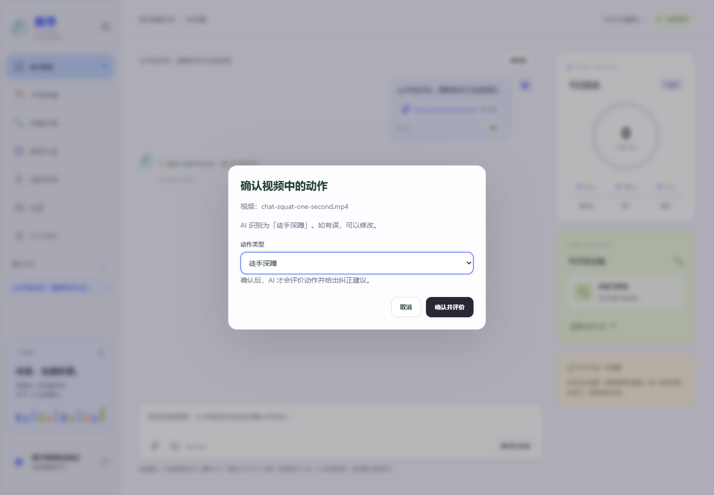
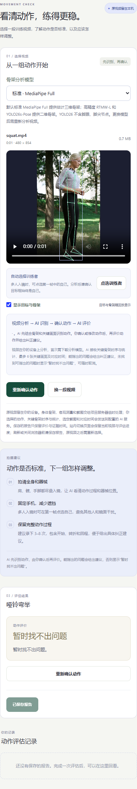
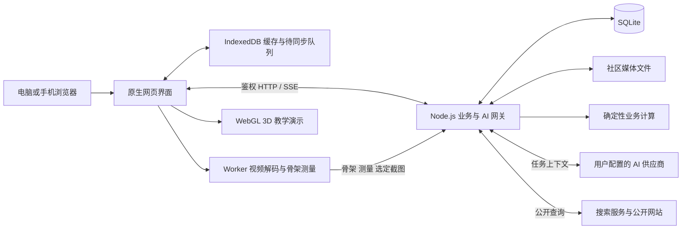

# 循序 AI 健身助手设计文档

2026年华北五省（市、自治区）及港澳台大学生计算机应用大赛<br>
移动互联网应用创新<br>
移动互联网应用程序开发

**项目名称：循序 AI 健身助手**<br>
**文档形式：Markdown 设计稿**<br>
**当前作品形态：响应式 Web / PWA；Android APK、Windows EXE 为后续目标，尚未打包与验收**

| 封面信息 | 内容 |
| --- | --- |
| 所在赛区 | 待填写 |
| 所在学校 | 待填写 |
| 团队名称 | 待填写 |
| 团队成员 | 待填写 |
| 指导教师 | 待填写 |
| 提交日期 | 待填写 |

文档版本：2.0；内容核对日期：2026-10-06；代码基线：Git `277ecaa`。提交日期与内容核对日期是不同字段。

本稿依据 [设计文档模板-2026年.doc](设计文档模板-2026年.doc) 的封面、声明和七章结构编写，用于说明作品需求、设计思路、原型、实现、平台与开发进度。模板中的“绿色星球”、Symbian 示例与虚构人员不沿用；模板封面的 Android 示例改为项目实际交付状态。Markdown 阶段不承诺 Word 的页码、字号和分页，后续排版应使用原模板。

技术内容以当前代码、专项文档和 Git 实际变更为依据；历史提交用于解释演进，不能仅凭提交标题认定功能完成。个人与团队信息按用户要求保留“待填写”。

## 参赛作品知识产权声明

参赛作品名称：**循序 AI 健身助手**（下称该作品）。

以下为模板的待核对、待签署声明文本，当前稿没有替团队作出承诺或许可选择。项目包含开源库、预训练权重、字体及解剖资产，其来源与许可见第六章；原创部分与第三方部分需由参赛团队据实核对。

本小组全体成员，就该作品声明如下：

1. 该作品（含提交参赛的 App 应用、相关文档和介绍视频）是本小组成员的原创研究成果，不存在侵犯任何他人知识产权、涉及泄密或违反中华人民共和国法律法规的情形，且未在 2025 年___月____日前公开发布。
2. 我们确认：该作品知识产权归本小组成员所有，且签署本声明的人员能够代表全体小组成员的意愿。
3. 我们承诺：将仅由本小组成员参加大赛答辩。
4. 大赛举办方为宣传大赛、推广参赛作品，以及为未来各届大赛的参赛选手提供参考等非盈利目的，可能需要以下列形式使用参赛作品，就此我们确认：

| 模板许可事项 | 选择 |
| --- | --- |
| 将参赛作品相关文档结集出版（含公开发行） | □ 同意　□ 不同意，待填写 |
| 在相关网站（含大赛官网及第三方视频平台）上传和播放介绍视频或幻灯片 | □ 同意　□ 不同意，待填写 |
| 在大赛官方网站提供 App 应用免费下载 | □ 同意　□ 不同意，待填写 |

作出上述许可，同样不违反本声明第 1 款的要求。

作品小组全体成员签署：**待填写**<br>
日期：2026 年___月____日，**待填写**

模板第一款原文使用“2025 年”，与封面赛事年份不同，正式提交前应由团队按赛事要求核对；本稿未擅自替换该条件。

## 目录

- [一、作品概述](#chapter-1)
- [二、作品可行性分析和目标群体](#chapter-2)
- [三、作品功能与原型设计](#chapter-3)
- [四、作品实现、难点及特色分析](#chapter-4)
- [五、团队介绍和人员分工](#chapter-5)
- [六、其他](#chapter-6)
- [七、致谢](#chapter-7)


<a id="chapter-1"></a>

## 一、作品概述

### （1）作品背景与设计目标

“循序”面向需要管理日常训练与饮食的用户，将个人档案、训练排期、饮食记录、知识查阅、动作辅助纠正和社区交流放在同一账号下。用户既可独立使用记录与计算工具，也可通过 AI 对话查询资料、生成建议和执行明确要求的数据操作。

核心使用过程为：建立档案 → 制定并确认计划 → 安排和完成训练 → 记录饮食与体重 → 查看阶段变化 → 调整下一阶段。视频动作评估帮助用户观察自己的训练，3D 教学演示帮助理解动作要领。

| 用户问题 | 设计响应 |
| --- | --- |
| 训练、饮食和体重记录分散 | 以账号私有记录连接日历、营养目标、阶段资料和 AI 上下文 |
| 建议难以落实到日期与具体份量 | 训练保存为日期任务，食物保存实际克数及每 100 g 营养 |
| AI 容易把建议说成已执行，重试又可能重复写入 | 使用明确工具、真实版本校验、服务端回执和请求幂等 |
| 动作文字不易理解，训练视频缺乏反馈 | 提供可操作的 3D 演示及骨架与视觉 AI 结合的辅助评价 |
| 自动识别可能选错动作 | 识别后预选，用户确认或修改后才评价 |
| 初始热量估算可能长期偏离实际变化 | 两周体重窗口渐进校准后续目标，允许关闭和额外调整 |
| 用户已有不同 AI 服务 | 统一三种协议，按任务独立选模 |
| 手机与电脑需要延续记录 | 同服务同账号同步，本机保留离线队列与冲突处理 |

### （2）当前交付范围

项目用于软件设计赛，当前重点为响应式网页与后端服务。电脑和手机浏览器访问同一服务器；Windows EXE、Android APK 是后续目标，尚未实现、打包或验收。

部署按 2 核 CPU、4 GB 内存的小规模服务设计。服务器执行业务计算、存储和 AI 转发；视频解码、骨架推理及 3D 渲染使用用户设备算力。该配置是约束和起点，不是已压测的承载量承诺。

### （3）最新进度与 Git 演进

下表按仓库历史选择能够解释设计变化的提交。同日可包含多次开发和合并，合并提交不重复计为新增功能。

| 时间 | 提交 | 实际变更范围 | 当前设计意义 |
| --- | --- | --- | --- |
| 2026-09-29 | `dc90faf` | 初始版本已有前后端、账号、AI、训练饮食、3D 与测试 | 已有可运行应用，不能再描述为只有三个动作原型 |
| 2026-09-30 | `23e18ed` | 繁忙日界面、日程排期及测试 | 训练内容与实际日期分离，支持不可训练日期 |
| 2026-10-01 | `17f7c4b` | 方案库模块、模板与界面 | 可保存和复用方案，草案不直接覆盖当前计划 |
| 2026-10-02 | `316e646` | 成就规则、服务端存储、界面与核验 | 成就依赖有效记录，而非仅靠页面勾选 |
| 2026-10-03 | `f32c8fd` | 社区、通知、私信、群聊、媒体与验证脚本 | 社区成为独立业务域，与健康资料隔离 |
| 2026-10-04 | `7bb43ae` | RTMW-L / YOLOX 适配器、ONNX Runtime 与模型资产 | 高精度姿态在浏览器推理 |
| 2026-10-04 | `741453e` | guided 评价及动作选择核对 | 当时先由用户选动作；后被识别后确认流程更新 |
| 2026-10-05 | `e4a27c0` | 聊天动作工具、客户端准备和报告回执 | 对话可以调起动作评估并复用数据链路 |
| 2026-10-06 | `3a35a1e` | MediaPipe Full 与模型选择 | 增加标准档并设为默认 |
| 2026-10-06 | `483ccd0` | 营养反馈、界面、计算及上下文 | 两周体重反馈自动影响后续目标 |
| 2026-10-06 | `7156385` | 搜索配置、搜索/网页工具与测试 | 配置的模型可使用应用提供的联网能力 |
| 2026-10-06 | `eee3b4e` | YOLO26s-Pose 适配、资产与验证 | 增加独立姿态路径，不借其他模型补点 |
| 2026-10-06 | `7bc912c` | MediaPipe 世界坐标、三维测量和传输 | 标准档用三维点计算角度并交给 AI |
| 2026-10-06 | `9de0d04` | 识别接口、确认界面、聊天确认和结果文案 | 默认变为“骨架分析 → 识别 → 用户确认 → 评价” |
| 2026-10-06 | `277ecaa` | 最新合并基线 | 本文依据合并后状态，区别于旧分支方案 |

核对方式：`git show <提交号> --stat` 查看范围，`git show <提交号> -- <路径>` 核对具体修改。原始需求清单保留在 Git 历史中。具体版本、规则及边界以当前代码和专项文档为准。

<a id="chapter-2"></a>

## 二、作品可行性分析和目标群体

### （1）可行性分析

**技术可行性。** 仓库已具备账号、记录同步、业务计算、AI 接入、浏览器骨架分析、3D 和社区模块，并保留对应测试与浏览器脚本。主服务采用 Node.js 内置能力与 SQLite，骨架由终端执行，生成式模型由外部供应商提供，避免在 2 核 4 GB 服务器上部署大模型。当前证据能够说明各处理链路已经实现，实际纠正准确率、终端适配和部署承载量仍需分别验证。

**操作可行性。** 七个主入口覆盖日常使用，用户无需了解协议或骨架节点即可建档、排课和记餐。复杂行为分阶段呈现：餐食先估算再确认，训练先编辑再应用，视频先识别再确认动作。手机采用响应式布局与可触摸控件；页面切换、取消和重试保留必要状态，减少重复填写。

**经济可行性。** 应用不要求自建生成式模型服务器，主服务运行组件少，默认搜索无需单独密钥；用户仍可能承担服务器、存储、带宽及模型调用费用。RTMW 大资产的首次下载、社区媒体增长和视觉 AI 图片调用是主要成本来源。当前没有已验证的年度预算、付费转化或盈利数据，不填写虚构金额。

**开发与维护可行性。** 业务纯函数、协议适配器、姿态模型、界面和存储分开，Git 可追溯关键变更。既有测试可支撑局部修改，专项文档记录资产恢复、接口和验收。维护风险主要是主界面规模增大、外部模型能力变化以及浏览器差异，因此要维持契约校验和按模块回归。

### （2）目标群体

主要服务希望持续记录训练与饮食的普通成年用户，包括需要指导的新手、训练时间不固定的学生或上班族，以及希望通过视频复盘动作的训练者。社区面向希望交流经验和分享进步的同服务用户。

需求判断来自项目原始功能要求与开发迭代，当前没有独立市场调查样本或用户统计，不能把这些目标群体描述为已完成量化市场验证。营养自动目标沿用普通成年人的估算范围，不覆盖需要个体医疗方案的场景。

#### 1. 参与方与权限

| 角色 | 主要目标 | 权限边界 |
| --- | --- | --- |
| 未登录访客 | 了解产品、注册或登录 | 产品介绍与身份入口，当前不能直接浏览社区正文 |
| 普通用户 | 训练、记餐、复盘、问答、评估与交流 | 自己的私有记录和配置，及社区允许访问的内容 |
| 群主、群管理员 | 维护群内交流 | 按角色管理成员、公告和禁言，不获得健康档案权限 |
| 社区管理员 | 处理举报 | 由服务器配置授权，不能由客户端自行赋权 |
| 部署维护者 | 运行、升级、备份和恢复服务 | 维护实例与数据目录 |
| AI 与搜索服务 | 处理必要输入并返回结果 | 外部处理方，不能直接获得数据库写入身份 |

#### 2. 功能需求分析

| 编号 | 需求 | 当前实现及验收重点 |
| --- | --- | --- |
| FR-01 | 账号与档案 | 注册登录、五项建档、阶段历史、个人中心、导出删除；私有记录按账号隔离 |
| FR-02 | 连续 AI 对话 | 流式、附件、历史、停止重试、按需上下文；真实回执才表示已执行 |
| FR-03 | 多供应商选模 | 12 家预设及自定义，三协议，chat/meal/planning/motion 独立选择 |
| FR-04 | 联网 | 默认免密钥搜索，可关闭和切换；来源可追溯，失败不冒充成功 |
| FR-05 | 训练与排期 | 1–5 分化、肌群组合、方案库、固定计划、循环、繁忙日及历史快照 |
| FR-06 | 饮食管理 | 自动日类型、估算修订、确认入账、食谱替换；份量倍率正确、不重复记餐 |
| FR-07 | 两周反馈 | 默认自动调整下一周期，异常和历史日期使用统一规则 |
| FR-08 | 知识与 3D | 五面板、25 动作、肌肉点选与演示控制；AI 通过工具选择卡片 |
| FR-09 | 视频分析 | 三类骨架模型，默认标准；先识别、可修改、确认后才评价 |
| FR-10 | 评价与复用 | 有问题则具体纠正，否则统一文案；同视频同模型复用分析 |
| FR-11 | 成就和复盘 | 核验有效训练，展示成就与阶段趋势 |
| FR-12 | 社区 | 图文视频、评论、关注赞藏、主页、私信群聊、通知举报 |
| FR-13 | 同步与离线暂存 | IndexedDB 队列、增量同步和版本冲突；社区草稿限本机 |
| FR-14 | 多端入口 | 网页已实现；EXE/APK 为后续目标 |

#### 3. 非功能需求分析

| 维度 | 要求 |
| --- | --- |
| 可用性 | 长任务有进度和取消，失败保留重试输入，手机能完成核心流程 |
| 一致性 | 日期、份量、营养校准在页面与 AI 工具中采用同一口径 |
| 可控性 | 手动草案确认后生效，聊天只执行明确要求，动作评价等待确认 |
| 性能 | 视频任务使用 Worker；模型按需加载；AI 有证据预算；限制并行 3D 实例 |
| 可靠性 | 版本检查、幂等、增量游标、删除标记、完整备份 |
| 隐私 | 原动作视频留本机，健康档案不自动公开，密钥不出现在导出和公开配置中 |
| 安全 | 同源写入校验、服务端授权、附件隔离、输出清理、URL/DNS 检查 |
| 可维护性 | 计算、协议、姿态适配、界面分层，资源来源和哈希可核对 |
| 可验证性 | 区分链路验证、AI 精度和容量压测，按变更范围选择测试 |

<a id="chapter-3"></a>

## 三、作品功能与原型设计

### （1）功能概述

各模块以同一账号和记录体系协同。以下描述当前已实现能力及其边界；后续功能集中列入第六章。

#### 1. 账号、档案与个人中心

注册登录后，以年龄、性别、身高、体重和目标完成首次建档。当前资料与按日期的阶段资料分别保存，体重更新形成历史序列。首次界面保存活动系数 1.375，编辑时保留已有值，不因打开表单改变计算假设。

个人中心汇总主页、健康档案、成就、AI 服务和数据管理。社区使用独立昵称、头像、简介；邮箱、健康参数、饮食和模型配置不随主页公开。收藏可选公开或私密，默认私密。

导出提供可读 JSON，没有个人一键导入界面，不能替代一致性备份。删除账号需验证密码，撤销会话并清理所属服务端数据；历史备份及离线设备副本不属于远程擦除范围。

入口：[主应用](public/app.js)、[账号接口](server.mjs)、[存储](server/storage.mjs)、[客户端仓库](public/store.js)。

#### 2. AI 对话与任务模型配置

**任务分工。** `chat` 负责对话和调度，`meal` 负责餐食识别，`planning` 负责规划建议，`motion` 负责动作识别及评价。可以选同一模型，也可以分别配置。聊天调用动作工具，不代表动作判断必须使用聊天模型。

**配置。** 12 家预设及自定义服务支持 OpenAI 兼容 Chat Completions、Anthropic Messages、Gemini GenerateContent。用户可以获取、搜索、启用模型、手动添加 ID 和测试连接。图片能力依据供应商字段或手动确认，不按名称猜测；动作点评必须确认支持图片，工具操作要求模型支持工具调用。地址或协议改变时不能直接沿用旧密钥发往新目标，配置保存带版本校验。

**按需上下文。** 首次请求携带基本行为规则、日期/时区、近期对话与当前附件，档案、营养、训练历史、动作和肌肉目录由 `read_chat_context` 按需读取。先读计划、日程或今日饮食的真实版本，再开放对应修改工具。完整读取内容仅进入本轮模型上下文，不反复保存为后续提示。

客户端提交最近 80 条有效消息，服务端按约 60,000 字符保留近期完整消息。更早原文可通过历史工具查询，历史附件先提供引用，需要时再读取原件，范围限当前账号及会话。

**操作一致性。** 每次提问固定 `requestId`，重试与重新生成沿用它。工具核对记录版本、账号和参数，已完成变更保存回执；停止回答不撤销已经保存的数据。模型明确不支持工具时使用兼容回答，不伪造操作。

**交互。** 支持流式 Markdown、停止、重试、复制、附件粘贴拖入及历史会话。普通附件每个最多 8 MB，每消息最多 6 个；图片/PDF 按协议发送，TXT/Markdown/CSV/JSON 作为文本，不解析任意二进制、Word 或 Excel。

入口：[上下文](server/chat-context.mjs)、[流式调度](server/chat-stream.mjs)、[工具策略](server/chat-tool-policy.mjs)、[协议适配](server/providers.mjs)、[AI 对话](docs/AI对话.md)、[供应商](docs/AI供应商.md)。

#### 3. 联网搜索与来源

联网是应用提供给模型的工具能力。未保存搜索设置的账号默认启用 Exa MCP 免密钥搜索，已保存的关闭状态或选择保留。可改用 Tavily、Brave Search，搜索密钥与模型密钥独立。

对话、规划、餐食任务按需调用 `web_search`、`read_web_page`。普通问答不强制搜索；动作评价依赖视频证据，网页不能证明用户动作事实。

每轮最多 3 次搜索和 3 次网页读取，搜索最多返回 5 个来源；网页只读公开 HTML/文本，最多提取 8000 字符，不登录、不执行脚本、不解析 PDF。展示来源及查询时间，历史保留链接，失败维持真实失败状态。

网页和摘要作为不可信资料，不能授权修改记录。逐跳校验 URL 和 DNS 并固定公开连接地址；即使允许本机 AI，网页工具仍不能访问内网和云元数据。

入口：[服务与配置](server/web-search.mjs)、[来源展示](public/web-search.js)、[联网说明](docs/联网搜索.md)。

#### 4. 训练计划、方案库与日程

草案用于编辑，固定计划确定当前内容，日期任务保存安排，实际记录保存完成组数、次数和重量，方案库存放可复用模板。各层职责分开，避免改模板影响历史训练。

当前主界面通过 `generateGroupedPlan` 支持 1–5 分化，在每个训练日组合胸、背、肩、腿、手臂，并选择标准或居家方案。新方案默认每动作 4 组 × 8 次，平板支撑为 20–40 秒，复合/单关节休息分别为 150/75 秒；用户可编辑后确认。旧 `generatePlan` 的二至五分化及肩单练、手臂单练变式作为历史规则保留，不是当前主入口。部分分组参考 Excel，其余为应用扩展，不逐格复刻工作簿。普通建议不会替换固定计划。

日程按周/日期展示，同日允许多项训练。拖动未完成任务保留 ID，已完成训练保留日期，实际记录仍可修订。任务以 `daySnapshot` 和 `planVersion` 保留动作快照，更换固定计划不改写历史内容。

AI 持续循环默认首次安排未来 84 天；手动导入按所选日期所在周一开始的 84 日窗口生成，从所选日起排到窗口末尾。浏览更远日期继续补齐。指定每周一、三、五时按真实星期轮换内容，繁忙日顺延到下一允许星期；未指定时按训练/休息循环。用户明确只安排某段时间时才建立有限排期。

更新计划调整生效日起未来未完成的关联任务；删除同时停止循环。过去、已完成和无关任务保留。繁忙日与假日参与统一排期，日期规则不由 AI 自由推算。

入口：[领域规则](public/domain.js)、[方案库](public/plan-library.js)、[排期](public/schedule.js)、[繁忙日](public/busy-rules.js)、[计划工具](server/plan-tools.mjs)、[日程数据](server/calendar-data.mjs)、[训练日程](docs/训练日程.md)。


#### 5. 饮食记录与营养目标

**日类型。** 某日期至少有一项有效训练任务即为训练日，没有则为休息日。完成任务仍计入，删除或移走最后一项才改变类型。饮食页与 AI 营养上下文使用同一日类型及校准目标；当前规则食谱采用训练日目标，并应用当前热量修正值。

**记餐。** 照片、餐前餐后对比、标签或文字先形成估算草稿，允许补充说明、改份量、改营养。食物保存实际摄入克数和每 100 g 热量、蛋白质、碳水、脂肪，按份量换算。只有确认餐食计入摄入，修订同餐保留原记录，不新增重复条目。聊天中明确要求记录、修改或删除时可直接执行工具。

**计算。** 当前营养基线采用 Mifflin–St Jeor 简化式、活动系数、训练日附加估值和目标系数：减脂默认 15% 缺口、增肌 5% 盈余，宏量营养按项目规则分配。知识页独立代谢试算只乘活动系数，不另加训练热量，不修改个人目标。这些是实现口径，不是个体化处方。

| 项目 | 当前计算规则 |
| --- | --- |
| 静息代谢估算 | `10 × 体重kg + 6.25 × 身高cm − 5 × 年龄 + 性别常数`，男式 +5、女式 −161 |
| 每日消耗基线 | 静息估算 × 活动系数，训练日另加男 150 / 女 100 kcal 起始估值 |
| 未校准目标 | 消耗基线 × 目标系数（减脂 0.85、增肌 1.05、维持 1），保留 1200 kcal 应用下限 |
| 蛋白质 | 减脂 1.8 g/kg，其余 1.6 g/kg，同时不超过目标热量的 30% ÷ 4 |
| 脂肪与碳水 | 脂肪取目标热量的 28% ÷ 9；其余能量 ÷ 4 为碳水克数 |
| 食物合计 | 每 100 g 营养值 × 实际摄入克数 ÷ 100；显式零值保留 |

下限、活动系数和训练附加热量是应用初始规则，不是个人测量值。自动目标受年龄、孕哺等适用条件及低 BMI 规则限制；完整公式依据与取舍见算法专文。

**食谱。** 支持单餐/1–7 日规则食谱和 AI 建议。规则配餐返回真实总量与目标差额，不冒称 AI 生成。食物替换按能量或指定营养项等量换算，其他项可以变化；生熟换算使用本批实测重量比例，不硬编码通用吸水率。包装标签优先于内置近似值。

入口：[餐食契约](public/meal-contract.js)、[计算服务](server/compute.mjs)、[营养建议](server/nutrition-advice.mjs)、[算法来源](docs/算法来源.md)。

#### 6. 两周热量反馈校准

默认启用。保存新体重阶段记录后，服务端从记录确定性重算；满足条件自动调整下一周期目标，无需再次确认。没有后台定时器在缺少新体重时自行扣减目标。

| 步骤 | 当前规则 |
| --- | --- |
| 建立窗口 | 同日采用最后更新体重；起点至第一个相隔 14–21 天的终点；窗口不重叠 |
| 理论变化 | 按起点资料与逐日训练类型，求和 `(未经校准的基础目标 − 预计消耗) / 7700` |
| 实际变化 | 终点体重减起点体重 |
| 判断偏差 | 实际减理论；绝对偏差 ≤0.2 kg 时不调整 |
| 本轮修正 | `−25% × 偏差 × 7700 / 间隔天数`，取整，限 ±100 kcal/天 |
| 应用结果 | 自动累计修正与用户额外修正相加，同步作用于热量及宏量营养目标 |

自动累计及最终修正最多 ±300 kcal/天，并受训练/休息日较小基础目标的 15% 限制；保留原最低热量及低 BMI 负修正限制。可关闭自动值或填写额外修正。超过 21 天、异常体重变化、基础资料改变等按规则跳过或重建窗口。

历史日期不读取后续体重与设置，但修改旧记录会重算其后结果，因此不是不可变历史快照。此算法以目标执行为假设，不能只凭两次体重区分水分变化、漏记与真实代谢差异，也不承诺“误差归零”。

入口：[校准算法](public/nutrition-feedback.js)、[校准界面](public/nutrition-feedback-view.js)、[详细规则](docs/饮食反馈校准.md)。

#### 7. 知识大全与 3D 教学

知识大全包含营养计算、常见食物份量、RM 换算、3D 动作和肌肉图谱。RM 使用 Epley、Brzycki 两种公式，支持 1–15 次估算和反算；公式选择同步更新目标 RM 与表格，试算不写入训练记录。

目录有 25 项动作：24 项往复演示和平板支撑持续等长演示。支持肌群/单结构点选、名称、播放暂停、慢放、进度、旋转、视角与缩放。肌肉颜色、轨迹和蒙皮是教学近似，不是实测激活或力学结果。

3D 子项目通过同源 iframe 和消息桥接复用。聊天 AI 调用 `set_chat_visuals` 选择目录 ID，前端校验呈现，不按文字关键词自动插入。每条回答最多两张卡片，最近两条助手消息自动预览，旧卡片保留打开入口。复用 iframe，避免流式文字更新反复加载整套模型。

知识卡片当前为来源核对资料，尚未形成独立专业审核知识库。Excel、解剖资产及第三方许可保留来源；新增动作需同步目录、轨迹、说明与验证，只增加名字不会自动生成演示。

入口：[知识工具](public/knowledge-tools.js)、[卡片校验](public/visuals.js)、[模型视图](public/model-viewer.js)、[3D 子项目](精细模型与动作开发/README.md)、[知识大全](docs/知识大全.md)。

#### 8. 视频动作评估

##### 8.1 三类模型的职责

| 层次 | 用途 | 实现 |
| --- | --- | --- |
| 骨架模型 | 每个采样画面中的人物和关节点 | 浏览器 MediaPipe Full、RTMW-L、YOLO26s-Pose |
| 动作 AI 模型 | 结合骨架、测量、截图识别与评价 | 用户配置的 `motion` 图片模型 |
| 3D 教学模型 | 预制动作与解剖结构演示 | Three.js 精细人体模型，与视频推理独立 |

“高精度”是档位名称，不代表已证明对全部视频更准确。骨架提取、动作识别与纠正结论须分别验证。

##### 8.2 骨架选择与坐标

| 档位 / ID | 原生输出 | 当前身体证据 | 坐标与角度 |
| --- | --- | --- | --- |
| 标准 / `mediapipe-full`，默认 | Full 33 点及世界坐标 | 17 个主要身体点，二维和三维并存 | `worldLandmarks` 米制 x/y/z，髋中点为原点；三维角度 |
| 高精度 / `rtmw` | RTMW-L WholeBody 133 点 | 17 个主要身体点 | 二维点和按画面尺寸换算的投影角度 |
| YOLO26 / `yolo26` | YOLO26s-Pose COCO 17 点 | 13 个主要身体点 | 二维点与投影角度，独立完成检测与姿态 |

17 个身体点为鼻、双侧肩、肘、腕、髋、膝、踝、脚跟及前脚掌。YOLO26 保留鼻及双侧六组关节，没有脚跟和前脚掌；不借其他模型补点。默认不传脸部细节和手指。兼容数组中的 33 个槽位不代表 33 个有效点，缺失保持 `null`。

标准档深度和尺度是单目模型估计，躯干倾角未经重力标定；三维点缺失时保持空测量，不切换为二维角度。RTMW-L、YOLO26 不补造 z 坐标。GPU 不可用时采用所选模型的 CPU 路径。

##### 8.3 默认流程



先读取视频信息与首帧，可在首帧点选训练者。产品页面与聊天明确以 7.5 Hz 调用分析，底层 `analyzeVideo` 保留 15 Hz 兼容默认值。分析连续跟踪同一目标，计算左右各六项客观角度。此阶段不判断对错、不生成本地动作分数。

识别结果需匹配目录且具备有效证据才自动预选；未知或识别请求失败时允许手动选择。确认前不请求评价、不保存未评价报告。改动作复用骨架、测量与截图；换视频、对象或骨架模型后重新分析。

##### 8.4 数据与证据预算

单段最多 120 秒、200 MiB（界面简写为 200 MB）。浏览器无法读取画面时由本地 FFmpeg WASM 回退解码，处理支持的编码、旋转和 HDR，不生成中间 MP4、不上传原片。视频是否能读取仍取决于实际编码、文件完整性和设备资源。

本机保留全段采样骨架及逐帧测量。默认 AI 输入为代表帧、对应角度、覆盖全段的窗口统计和最多 6 张截图；骨架证据 24,000 字符，总文本 32,000 字符。短片可包含全部采样帧，长片按时间、变化及极值抽取，因此本机全段分析不等于 AI 收到每帧原始数据。

传输格式：MediaPipe `schemaVersion:6 / mediapipe-world17-full`，RTMW `schemaVersion:3 / rtmw-body17-full`，YOLO26 `schemaVersion:5 / yolo26-body13-full`。三维点为 `[x,y,z,visibility]`，坐标和置信度独立。旧格式、显式完整分包等模式仍兼容，默认界面使用识别后的 guided 评价。

##### 8.5 结果、保存和生命周期

能指出具体问题则展示最多三条问题、建议与回放时间，引用必须来自实际发送证据。无效建议过滤，独立有效的问题保留。

没有可指出的具体问题时，无论未发现偏差、识别不清、骨架不足或动作核对不确定，对外统一“暂时找不出问题”。内部保留 `standard` 与 `uncertain`，不把缺少问题转换为“已证明标准”。网络、授权和文件处理失败保留可重试错误，不伪造完成报告。

同账号站内导航保留视频、缓存和未保存结果；刷新、关页、退出账号会释放这些内存。独立页面由用户保存，聊天评价完成后自动保存并返回卡片。报告跨端同步，原视频、完整骨架和截图不写入报告。

聊天 `assess_motion_video` 调起同一流程，未指定骨架模型时用标准档。确认窗口仅在原聊天可见时打开；聊天动作名只是提示，不能代替确认。服务端核验 `actionConfirmed:true`，按账号、请求、视频和骨架模型管理幂等；改变动作提示不重复评价。完整报告供前端查看，聊天模型只接收精简回执，避免正文和结果卡片矛盾。

| 文件 | 职责 |
| --- | --- |
| [motion-models.js](public/motion-models.js) | 模型目录、默认值与超时 |
| [motion-worker.js](public/motion-worker.js)、[motion-source-worker.js](public/motion-source-worker.js) | 本机视频、推理任务与生命周期 |
| [motion-mediapipe.js](public/motion-mediapipe.js)、[motion-rtmw.js](public/motion-rtmw.js)、[motion-yolo26.js](public/motion-yolo26.js) | 三个模型适配器 |
| [motion-analysis.js](public/motion-analysis.js)、[motion-pose-data.js](public/motion-pose-data.js) | 测量、坐标与传输 |
| [motion-recognize.mjs](server/motion-recognize.mjs) | 识别提示、目录匹配和响应校验 |
| [motion-coach-guided.mjs](server/motion-coach-guided.mjs) | 确认后评价提示、证据预算与约束 |
| [motion-coach-context.mjs](server/motion-coach-context.mjs) | 共享上下文与证据组织 |
| [motion-verdict.js](public/motion-verdict.js) | 结论归一化与统一文案 |
| [motion-view.js](public/motion-view.js)、[chat-motion-confirm.js](public/chat-motion-confirm.js) | 页面状态及用户确认 |
| [chat-motion.mjs](server/chat-motion.mjs) | 聊天任务、确认校验、保存和幂等 |

详见 [视频动作评估](docs/视频动作评估.md)、[MediaPipe 三维](docs/MediaPipe三维接入.md)、[RTMW-L](docs/RTMW-L接入.md)、[YOLO26](docs/YOLO26接入.md)。

#### 9. 成就和阶段复盘

训练完成不能仅凭客户端声明，服务端核验任务日期、动作及有效完成数据，支持逐项完成与匹配实际训练记录的核验路径；未来训练不能提前完成。成就模块按有效训练、周期和里程碑生成成就墙，显示已获得内容和待达成进度。

当前包含首次、累计训练次数、周达成与持续周数、完整循环、间隔后再次出发等 12 类成就。周按北京时间周一至周日计算，结束后才结算周成就；循环依保留的定义、版本与槽位核对。后改计划不能降低既有核验门槛，删除或撤销有效记录可能撤销派生成就，不承诺永久保留。

复盘整合带日期体重、确认饮食、实际训练和校准结果。没有记录的日期不作“摄入零”参与均值，缺失记录也不等于未训练。AI 解释时区分实际记录、公式结果与估算。

入口：[成就数据](public/achievements.js)、[核验](server/achievements.mjs)、[规则](server/achievement-rules.mjs)、[周期](server/achievement-cycles.mjs)。

#### 10. 社区与消息

一期已实现推荐/关注/分类流、笔记与账号搜索、图文视频发布、详情、评论回复、赞藏、关注、主页、本机草稿、通知、私信、群聊和举报。桌面详情采用媒体/评论双栏，手机为双列信息流和全屏详情。

笔记最多九张图片，或带独立封面的短视频。社区视频限 MP4、50 MiB、60 秒，使用支持的 H.264/AAC 组合且不自动转码，与动作分析视频的限制不同。私信、群消息、评论和回复已支持最多九张 JPEG/PNG/静态 WebP，每张 10 MiB，可预览、移除、重试和查看大图。

群主、管理员按角色处理公告、申请、邀请、成员、禁言及 @ 提醒；群主另有任免、转让、解散权限。加入需审批或接受邀请，退出/移除后不能继续访问受保护资源。头像主页链接不会授予健康资料权限。

内容当前面向同服务已登录用户，站外链接先登录；有权限管理员处理笔记及评论举报。通知定期轮询、恢复前台刷新，不是独立推送服务。

草稿按账号保存在本机 IndexedDB，离线可编辑，发布和媒体访问需联网，不自动跨端或发布。分享卡片、访客浏览、话题聚合、媒体转码仍为后续规划。

入口：[社区界面](public/community.js)、[群界面](public/community-groups.js)、[社区服务](server/community.mjs)、[消息](server/community-messages.mjs)、[群服务](server/community-groups.mjs)、[社区设计](docs/社区功能设计.md)。

### （2）原型设计

#### 1. 平台与信息架构

当前实现平台为现代桌面/手机浏览器中的响应式 Web/PWA。主要开发验证包含 Edge 桌面与手机视口模拟；这不等于已经完成 Android 原生客户端或所有真机验收。页面不采用模板示例中的 Symbian 平台、固定 360×640 分辨率或指定手机型号。



桌面保留侧栏、最近对话和顶部同步状态；手机使用可收起导航。对话是主要入口，但记录、计算与知识功能均可独立进入，不要求每次通过聊天。

#### 2. 页面组成与交互

| 页面 | 主要区域 | 用户操作与反馈 |
| --- | --- | --- |
| 介绍与登录 | 品牌说明、产品功能、登录/注册表单 | 了解作品，创建账号，进入建档 |
| AI 对话 | 会话历史、消息区、工具状态、附件与输入框、今日概况 | 发送、停止、重试；结果卡片对应真实回执 |
| 今日饮食 | 日期与日类型、目标/摄入/余量、餐食、建议、两周校准 | 估算修订后确认；记录体重后更新校准 |
| 训练计划 | 周日期格、任务、方案库、繁忙日和训练记录 | 添加/拖动任务，应用方案，逐项记录完成 |
| 知识大全 | 营养、份量、RM、3D、肌肉图谱页签 | 试算、切换公式、筛选动作、操控模型 |
| 动作评估 | 模型与视频、人物选择、进度、动作确认、评价、记录 | 先分析，再确认；问题可回放，无问题统一文案 |
| 社区 | 信息流、搜索、详情、发布、主页、消息与通知 | 浏览、互动、发帖、聊天、举报；草稿独立保留 |
| 个人中心 | 公开主页、私有档案、成就、AI 与数据设置 | 分清公开/私有范围，配置任务模型和搜索 |

#### 3. 关键界面实图与说明

以下为已有浏览器 QA 生成的实际界面截图，使用测试账号/样例视频和受控 AI 回复。它们用于说明布局、确认与结果状态，不作为真实动作识别准确率证明。桌面截图和手机视口截图均来自当前两阶段动作流程；其他页面结构以代码和上表说明为准。



图 1：标准骨架模型为默认；上传与跟踪区下方出现动作确认区，按钮明确为“确认动作，开始评价”，确认前不展示评价报告。



图 2：对话模型调起评估后显示视频名称和可修改的动作，取消不会提交评价；用户确认后调用动作模型进行评价。



图 3：手机采用纵向布局。截图中的动作名及结果为 QA 场景设置；没有有效具体问题时显示“暂时找不出问题”，不额外展示相反结论。

#### 4. 状态和可操作性设计

视频流程使用“未选视频—准备—本机分析—识别—待确认—评价—结果—保存”等阶段组织交互。长任务期间避免同时修改相关模型和视频；同账号站内切换保持进度，换视频或退出账号取消旧任务，迟到结果不能覆盖新状态。

输入框有明确名称、错误提示和禁用状态；中文输入法确认候选词不触发发送。模型视图使用可点击控件与键盘支持，错误时保留文字信息。旧资料和已保存报告可阅读，不应在等待新结果时误标为本次分析完成。


<a id="chapter-4"></a>

## 四、作品实现、难点及特色分析

### （1）作品实现及难点

#### 1. 总体架构与设计思路

##### 真实记录、确定性计算与 AI 分工

档案、计划、餐食、日程和报告由记录系统保存。营养合计、RM、排期等确定性结果由业务代码计算；AI 负责自然语言理解、图片识别、解释与工具选择。自然语言回答不直接转换为数据库写入。

这样切换供应商不会改变记录口径，也能核对“已保存”是否对应真实回执。阅读建议和执行修改采用不同路径，避免普通咨询意外变更计划。

##### 系统架构



原视频进入浏览器分析链路，选定骨架、测量和截图才进入动作 AI 请求。私有附件、餐食图片和社区媒体有各自上传流程，“动作原视频不上传”不等于所有文件都不离开本机。

后端采用单个 Node.js HTTP 服务与 SQLite，减少小规模部署组件；内部按存储、计算、AI、聊天工具、动作、社区拆分。前端使用原生 ES Modules，主界面由 `public/app.js` 组织，复杂功能进入专用模块。

部分纯函数放在 `public/` 供服务器与测试复用，源码位置不代表在线业务公式由浏览器执行。当前通过 `/api/compute` 服务端计算；离线保留缓存和可暂存输入，不在浏览器重新运行营养与排期公式。

##### 关键取舍

| 决策 | 设计理由 | 代价或边界 |
| --- | --- | --- |
| 原生网页与 Node 内置模块 | 部署简单、代码可审查、便于复用 | 主界面较大，需继续保持模块职责 |
| SQLite 与按账号通用记录 | 便于事务、版本同步和增加类型 | 不是多实例分布式架构 |
| 用户自配模型、按任务选择 | 适应成本、视觉能力和服务差异 | 实际能力受所选供应商和模型影响 |
| 视频本机推理 | 降低服务器算力压力，原视频无需上传 | 终端性能和浏览器兼容性决定体验 |
| 识别与评价分阶段 | 用户可先纠正动作类别 | 正常需要一次识别与一次评价调用 |
| AI 有限证据预算 | 控制上下文和请求体积 | 不能声称 AI 逐帧看完原视频 |
| 社区与私有记录分离 | 明确公开范围与权限 | 社区发布需独立操作 |

#### 2. 工具平台介绍

| 工具或平台 | 用途 | 选择理由及边界 |
| --- | --- | --- |
| HTML、CSS、原生 JavaScript ES Modules | 响应式网页和模块化交互 | 主应用不依赖前端框架运行环境 |
| Node.js ≥24 | HTTP、加密、文件及内置 SQLite | 主服务无第三方 npm 运行依赖 |
| SQLite / node:sqlite | 用户、记录、配置和社区关系 | 事务、外键、WAL，适合当前单实例 |
| IndexedDB、Service Worker、PWA manifest | 缓存、队列、草稿和应用壳 | Service Worker/完整 PWA 安装需安全上下文，IndexedDB 保存本机数据；不等于原生 EXE/APK |
| Web Workers、WebCodecs 与视频接口 | 本机解码与姿态任务 | 降低主界面阻塞，提供兼容路径 |
| MP4Box 2.4.1 | MP4 解封装与顺序帧读取协作 | 配合浏览器视频解码，不能替代所有编码的解码器 |
| MediaPipe Tasks Vision 0.10.32、Full float16 v1 | 标准默认骨架 | 33 点与估计世界坐标，本地资产按需加载 |
| ONNX Runtime Web 1.30.0、WebGPU/WASM | RTMW、YOLO26 推理 | GPU 可用时加速，否则同模型 CPU |
| RTMW-L 384×288、YOLOX-tiny 检测器 | 高精度姿态路径 | 原生 133 点，默认业务使用身体子集 |
| YOLO26s-Pose 640 ONNX | 独立 YOLO26 路径 | COCO 17 点，权重约 40 MiB，版本和哈希有清单 |
| FFmpeg WASM 0.12.10 | 软件解码回退 | 本地按需加载，不要求服务器安装 Python/CUDA |
| Three.js 0.186.0、esbuild | 3D 渲染及子项目构建 | 服务使用预构建资源，修改源码再构建 |
| Marked 18.0.14、DOMPurify 3.4.16 | Markdown 解析和清理 | 解析器不承担安全清理 |
| GSAP、ScrollTrigger 3.15.0 | 介绍页动画 | 本地资源，适应减少动态效果偏好 |
| Exa MCP、Tavily、Brave | 联网适配 | 默认免密钥，可用性受服务方限制 |
| Node Test Runner、Playwright、Edge | 单元、HTTP 和浏览器验证 | 使用临时数据及受控上游，真实精度另测 |
| Git | 版本与设计追踪 | 依据实际 diff，不以标题或计划文件认定完成 |

Excel 是需求及部分规则的参考，不是线上运行依赖；Cherry Studio 用作交互参考，没有复制其代码或引入 Electron 能力。

“主服务无 npm 运行依赖”不等于项目无第三方资源。3D 子项目有独立依赖，姿态权重、浏览器库、字体和模型资产各有版本与许可。当前锁定版本见 [浏览器依赖](public/vendor/README.md)、[3D package.json](精细模型与动作开发/package.json) 及模型 manifest，不将其表述为上游最新版本。

#### 3. 数据与接口设计

##### 服务端数据

| 数据域 | 主要表或载体 | 用途 |
| --- | --- | --- |
| 身份 | `users`、`sessions` | 账号、密码摘要、会话 |
| 私有记录 | `records` | 档案、阶段、餐食、计划、日程、会话和报告等带版本 JSON |
| 增量同步 | `record_changes` | 按账号递增变更序号，避免时间戳相同导致遗漏 |
| AI 配置 | `providers`、`preferences` | 模型列表、加密密钥、任务映射与版本 |
| 搜索 | `web_search_settings` | 开关、服务、加密搜索密钥及版本 |
| 私有附件 | `attachments` | 账号所属附件的元数据与二进制 |
| 社区 | `community_*` 及 `community-media/` | 内容、关系、消息、群权限和媒体 |
| 工具操作 | 操作回执与动作任务账本 | 幂等、重放、版本校验 |
| 成就 | 成就相关数据表与有效训练记录 | 完成核验、授予与周期 |

通用记录以 `(user_id,id)` 为主键，含 `kind`、JSON `data`、`version`、`deleted`、`updated_at`。核心 `kind` 包括 `profile`、`phase`、`meal`、`plan`、`training-template`、`calendar-task`、`training-cycle`、`nutrition-feedback-settings`、`motion-assessment`，另兼容旧草案类型 `draft`。`active-plan` 和 `calendar-cycle` 是固定记录 ID，`plan-draft` 是旧草案 ID，不应与类型混淆。扩展类型需同时考虑参数校验、同步和导出。

##### 同步和保存范围

客户端按账号保存缓存与待同步队列，恢复连接后提交带版本的变更，再读取服务端增量。同记录竞争修改由用户选择，迟到响应不能无提示覆盖新输入。服务端核对会话与 `X-Fitness-User`，旧账号请求不影响新账号；AI 修改前同步相关资料，再检查最新版本。

| 内容 | 本机 | 服务端及跨端 |
| --- | --- | --- |
| 个人记录、会话、保存报告 | IndexedDB 与队列 | 随账号同步 |
| 原动作视频、完整骨架及截图缓存 | 当前页面内存，刷新释放 | 不写入保存报告 |
| 当前 AI 所需骨架和截图 | 临时准备 | 经过项目服务及所选 AI，不等同同步存储 |
| 社区草稿 | 当前设备 IndexedDB | 不自动跨端或发布 |
| 已发布媒体 | 按需加载 | 文件与授权元数据由服务保存 |
| AI/搜索密钥 | 公开配置不含明文 | 加密存储，调用时解密 |

Service Worker 缓存应用壳及允许的静态资源，不缓存鉴权 API、私有图片和社区媒体。首次登录、业务计算、AI、新附件上传和跨端同步需要联网；离线限已加载页面、已有记录与可暂存输入。

##### 主要接口

| 接口 | 用途和约束 |
| --- | --- |
| `GET /api/health` | 服务存活，不证明外部 AI 和模型资产可用 |
| `POST /api/auth/register`、`/api/auth/login`、`/api/auth/logout` | 身份和 Cookie 会话 |
| `GET /api/auth/me` | 当前账号公开字段 |
| `GET /api/state`、`POST /api/sync` | 状态、增量游标、版本和冲突 |
| `POST /api/compute` | 固定 operation 白名单，不执行客户端代码 |
| `GET/PUT /api/providers` | 配置版本校验，响应无密钥明文 |
| `POST /api/providers/models`、`/api/providers/test` | 模型发现与连接测试 |
| `POST /api/ai` | chat/meal/planning，聊天支持 SSE 和工具回执 |
| `GET/PUT /api/web-search`、`POST /api/web-search/test` | 搜索设置与测试 |
| `POST /api/motion/coach` | recognize 不传选定动作，guided 传 `selectedExerciseId` |
| `POST /api/chat/motion/:jobId` | 聊天任务数据，核验用户、任务和 `actionConfirmed:true` |
| `/api/attachments`、`/api/attachments/:id` | 私有附件上传、读取、删除，按账号授权 |
| `/api/community/*` | 社区路由族，按资源、角色和成员关系授权 |
| `GET /api/export`、`DELETE /api/account` | 不含密钥的导出；删除需密码 |

计算请求为 `{operation,args}`，响应为 `{result}`；`snapshot` 批量返回营养、餐食、日期、训练及成就，可计算当前账号未同步输入，但不将计算输入直接写库。

SSE 事件包含 `meta`、`delta`、`tool_start`、`tool_result`、`motion_request`、`motion_progress`、`done`、`error`。已开始流式响应后的失败通过事件返回。操作卡片来自真实回执，普通 Markdown 没有执行能力。

#### 4. 安全与异常处理

密码采用随机盐与 scrypt，数据库保存随机会话令牌的摘要；写请求检查 Origin。记录、附件、社区媒体及群权限由服务端核验，不只隐藏按钮。AI/搜索密钥使用 AES-256-GCM 和数据目录 `server.key` 加密；私有数据库未整库加密，仍需保护目录与备份。

AI 目标检查 URL/DNS 并固定连接，拒绝云元数据；本机模型是否允许由部署配置决定，网页工具始终只读公开地址。AI 结构化结果经校验，Markdown 经清理；附件、网页和历史只是资料，不能成为新操作授权。

| 失败场景 | 处理方式 |
| --- | --- |
| 版本冲突 | 拒绝旧写入，保留编辑，选择或重新读取 |
| AI/搜索超时或能力不支持 | 明确错误或兼容状态，不伪造结果 |
| 动作识别未知 | 手动选择，复用骨架，确认后评价 |
| 没有有效动作问题 | 统一“暂时找不出问题”，内部保留状态 |
| 解码、模型加载或鉴权失败 | 可理解错误和重试，不生成未完成报告 |
| 取消及迟到响应 | 中止请求/Worker，丢弃失效结果，防止覆盖新账号或视频 |
| 聊天总结失败但报告已保存 | 结果卡片继续可用，重试不再重复评价 |
| 社区素材上传失败/过期 | 保留草稿，支持重试和发布前检查 |

#### 5. 部署与维护

##### 启动与网络

```powershell
node --version
npm start
```

默认访问 `http://localhost:3000`。电脑和手机跨端应连接同一 HTTPS 服务。局域网 HTTP 不能保证手机上的 Service Worker、相机或 WebGPU。

主要变量为 `PORT`、`HOST`、`DATA_DIR`、`COOKIE_SECURE`、`ALLOW_PRIVATE_AI` 和社区管理员 ID/邮箱。公开服务通过 HTTPS 代理并启用安全 Cookie，按部署需要限制内网 AI。具体默认值及反向代理示例见 [部署与接口](docs/部署与接口.md)。

##### 资源和备份

模型和 3D 资源从本服务按需下载，不依赖运行时 CDN。RTMW-L 大权重不随 Git 提交，新克隆需按接入文档恢复；`npm run motion:assets` 核对资源。

2 核 4 GB 起始部署需关注模型首次下载、社区文件增长、AI 并发和 SQLite 写入。浏览器推理速度不能由服务器 CPU 数推导。代理需支持 SSE 不缓冲、足够请求体和超时、媒体 Range 请求。

备份成套保留数据库及一致 WAL 状态、`server.key`、`community-media/`。简单方式是停服复制完整数据目录。缺密钥无法解密已有配置，缺媒体文件不能恢复正文资源，个人 JSON 导出不替代完整备份。

启动执行现有兼容迁移，静态缓存升级由 Service Worker 管理。升级验证应包含账号、配置、同步、模型资产与核心页面，不只检查首页打开。

#### 6. 验证与需求追踪

##### 分层验证

| 层级 | 验证内容 | 不足以证明 |
| --- | --- | --- |
| 单元/契约 | 公式、日期、节点、缺失值、状态及引用 | 浏览器交互与真实 AI 质量 |
| HTTP/SQLite | 登录、隔离、竞争、协议、幂等和持久化 | 用户设备视频速度和 GPU 兼容 |
| 浏览器 | 上传、确认、取消、导航、手机、刷新和离线 | 模拟响应的真实纠正准确率 |
| 真实姿态 + 受控 AI | 推理执行、坐标角度传输、截图与报告链路 | 视觉 AI 对真实错误的判断能力 |
| 真实 AI 数据集 | 识别、问题命中、误报漏报及人工复核 | 对所有模型、设备和动作的统一保证 |
| 部署压测 | 目标服务器并发、带宽、内存与恢复 | 不能由本地测试通过推定，仍需正式环境验证 |

##### 关键场景与已有入口

| 需求 | 核对场景 | 验证入口 |
| --- | --- | --- |
| FR-01、13 | 账号隔离、删除、同步冲突和重连 | `tests/server.test.mjs`、`store.test.mjs`、`sync-delta.test.mjs` |
| FR-02、03 | 三协议、任务选模、按需历史和回执 | `tests/chat-stream-server.test.mjs`、`chat-context.test.mjs`、`provider-models.test.mjs` |
| FR-04 | 默认/关闭、来源、网页权限与错误 | `tests/web-search.test.mjs`、`npm run qa:web-search` |
| FR-05 | 固定星期、繁忙日、历史保留、幂等 | `tests/schedule.test.mjs`、`ai-recurring-plan.test.mjs`、`plan-tools.test.mjs` |
| FR-06、07 | 倍率、确认、14/21 天边界、关闭与历史 | `tests/meal-workflow.test.mjs`、`nutrition-feedback.test.mjs`、`npm run qa:nutrition:feedback` |
| FR-08 | 目录与演示一致、工具卡片、实例复用 | `tests/visuals.test.mjs`、`model-viewer.test.mjs`、`scripts/qa-model-gallery.mjs` |
| FR-09、10 | 确认前不评价、可修改、复用、未知与文案 | `tests/motion-recognize-api.test.mjs`、`motion-view-guided.test.mjs`、`motion-verdict.test.mjs` |
| FR-09、10 | 聊天确认、取消、导航、幂等重放 | `tests/chat-motion-registry.test.mjs`、`npm run qa:chat:motion`、`npm run qa:motion:navigation` |
| FR-09 | 三维语义，二维模型不补深度/脚点 | `tests/motion-mediapipe-world-transport.test.mjs`、`motion-yolo-transport.test.mjs` |
| FR-11 | 未来和无效完成不授予、周期正确 | `tests/achievement-rules.test.mjs`、`achievement-http.test.mjs` |
| FR-12 | 媒体授权、图片、群权限、通知和举报 | `tests/community-*.test.mjs`、`npm run qa:community` 及专项脚本 |

本次文档更新核对代码、Git、模板结构和链接，不重新运行全套业务测试。代码变更按模块选择检查，跨域修改或发布前才扩大范围；`npm test` 和 `npm run check` 不要求每次文档修改执行。

既有新动作流程验收用真实 MediaPipe/RTMW 与受控 AI，覆盖确认、修改、未知、复用、导航及保存。历史真实 AI 小样本保留在 [视频动作评估](docs/视频动作评估.md)，不能当作新流程识别准确率。浏览器证据按日期见 [浏览器验证](docs/浏览器验证.md)。

#### 7. 实现难点及处理

| 难点 | 采用的处理 | 验证重点 |
| --- | --- | --- |
| 三种 AI 协议的消息和工具格式不同 | 统一业务契约，由适配层转换原生消息并保留必要工具关联 | 同一工具在三协议中能继续回答，失败不伪造回执 |
| 多模型节点、置信度和坐标不一致 | 显式模型标识与 schema，二维/三维分开，缺失保持空值 | 不造 z、脚点或置信度，不混用不同人的坐标 |
| 手机编码、HDR 和旋转差异 | 浏览器解码优先，本地 WASM 逐帧回退 | 图像、骨架、时间和回放保持对齐 |
| 长视频超出 AI 上下文 | 代表帧、窗口统计和最多六图，保留覆盖元信息 | AI 引用确为已发送证据，不声称逐帧完整观看 |
| 动作自动识别可能错误 | 识别与评价分开，人工确认后才评价 | 确认前无评价/报告，修改动作复用数据 |
| 异步响应和页面/账号变化 | 请求中止、身份/任务代次检查、状态保留 | 旧结果不覆盖新账号、视频、表单和会话 |
| AI 重试可能重复操作 | 版本检查、事务和请求账本 | 重试不重复记餐、排课或保存报告 |
| 私有健康数据与社区媒体边界复杂 | 数据域分离、资源引用及当前成员授权 | 私信、群、下架内容和附件不能越权读取 |
| 体重短期波动可能导致过调 | 两周窗口、死区、学习率、限幅及异常跳过 | 重复刷新不重复调整，历史不使用未来证据 |
| 高复杂度 3D 资源消耗终端性能 | iframe 复用、暂停、按需预览和实例限制 | 流式聊天不反复重建，低性能时仍能读文字 |

### （2）特色分析

1. **业务记录与自然语言协同。** 用户可通过页面或对话完成训练、日程和饮食管理，二者共享真实记录、计算口径和版本控制。
2. **先确认动作再纠正。** AI 提供动作建议，用户能纠正分类，确认后才评价，减少围绕错误动作给建议的机会。
3. **三条骨架路径与明确三维语义。** 默认 MediaPipe 三维兼顾身体证据，高精度与 YOLO26 作为独立选择；模型差异在节点和坐标契约中明确表达。
4. **终端承担视频计算。** 将解码和姿态任务放在用户设备，服务器负责业务与转发，有利于在小规模服务器上部署。
5. **教学演示与真实视频复盘互补。** 3D 用于讲解，视频用于观察个人训练，两者职责清晰，不把预制动画当成用户动作重建。
6. **渐进营养反馈。** 初始公式估算与阶段体重反馈相连，保留依据、手动调整和异常处理，不以一次波动大幅修改目标。
7. **用户模型可按需联网。** 搜索由应用统一提供，来源可查看，模型/搜索密钥分开，用户可关闭或替换服务。
8. **社区与个人隐私分区。** 分享和交流已经接入，同时健康档案及 AI 私有附件不会自动公开。

这些是当前实现的组合特点，不作“行业首创”、专业认证或量化效果领先的无证据宣称。


<a id="chapter-5"></a>

## 五、团队介绍和人员分工

| 项目 | 内容 |
| --- | --- |
| 所在学校 | 待填写 |
| 团队名称 | 待填写 |
| 队长 | 待填写 |
| 指导教师 | 待填写 |

| 团队成员 | 角色 | 实际负责内容 | 对应成果或提交 |
| --- | --- | --- | --- |
| 待填写 | 待填写 | 待填写 | 待填写 |
| 待填写 | 待填写 | 待填写 | 待填写 |
| 待填写 | 待填写 | 待填写 | 待填写 |

表格行数按实际团队成员调整，不代表已经确认三人团队。可按需求设计、界面与交互、后端与同步、AI/视频、3D 资源、测试与文档等工作填写，但不能把建议职责当作实际分工。Git 作者名和提交量不能直接替代成员身份、任职或贡献声明，需团队核对后填写。


<a id="chapter-6"></a>

## 六、其他

### （1）第三方资源与知识产权依据

作品的应用交互、业务组织和集成实现，与所采用的开源库、预训练模型及素材属于不同来源。正式参赛声明需据实区分，不把全部第三方资源写成团队原创。

| 资源 | 仓库记录的许可或来源 | 本地依据 |
| --- | --- | --- |
| MediaPipe Tasks Vision / Full | Apache-2.0 | [依赖说明](public/vendor/README.md)、[清单](public/vendor/mediapipe/manifest.json) |
| RTMW-L / YOLOX | Apache-2.0 | [清单](public/vendor/rtmw/manifest.json) |
| ONNX Runtime Web | MIT | [清单](public/vendor/onnxruntime/manifest.json) |
| YOLO26s-Pose | AGPL-3.0 | [清单](public/vendor/yolo26/manifest.json)、[许可证](public/vendor/yolo26/LICENSE) |
| FFmpeg WASM | 包含 GPL/LGPL 等组件说明 | [NOTICE](public/vendor/ffmpeg/NOTICE.txt) 与随包许可证 |
| Marked / DOMPurify | MIT；Apache-2.0 或 MPL-2.0 | [浏览器依赖](public/vendor/README.md) |
| 人体解剖资产 | Z-Anatomy / BodyParts3D，保留 CC BY-SA 等来源说明 | [解剖来源](精细模型与动作开发/assets/ANATOMY-SOURCE.md) |
| Three.js 与 3D 依赖 | 子项目保留第三方许可 | [第三方许可](精细模型与动作开发/THIRD_PARTY_LICENSES.txt) |
| GSAP、ScrollTrigger、字体 | 资源保留原有版权和许可说明 | [浏览器依赖](public/vendor/README.md) |
| 健身 Excel 参考 | 原项目资料，用于需求和部分规则核对 | [算法来源](docs/算法来源.md) |

本表记录仓库中的来源和许可事实，不替团队完成赛事原创性、公开日期和再分发许可的签署判断。

### （2）演示与提交说明

演示按“注册建档—查看训练计划—记录一餐—查看知识/3D—配置 AI—视频识别并确认—查看评价—浏览社区”的顺序进行。使用演示账号和样例数据，账号与密码**待填写**，不把真实账号密码或 API Key 写进公开文档。

网页启动与部署见第四章。演示前确认模型资产、网络、视频格式和所选 AI 图片/工具能力。若使用受控 AI 展示，应明确标注，不能把模拟结果写成真实准确率测评。当前没有可随文档提交的正式 EXE/APK，相关交付需另行完成。


### （3）当前边界与后续安排

| 方向 | 当前边界 | 下一阶段 |
| --- | --- | --- |
| 动作纠正 | 辅助试验版，可能误判 | 固定数据集和人工标签，分别评价识别、误报、漏报与证据 |
| 三维姿态 | 标准档为估计世界坐标，其余二维 | 多视角、遮挡和设备条件验证 |
| 设备与容量 | 终端性能各异，服务器未形成压测承诺 | 在目标服务器与主流终端验收 |
| 原生入口 | 网页/PWA 已实现 | 确定 EXE/APK 方案并验证文件、视频和同步 |
| 社区二期 | 访客、分享卡片、话题聚合、转码未实现 | 按实际需求分阶段实现 |
| 知识和营养 | 来源核对与应用估算，未独立专业审核 | 审核、适用范围复核及版本维护 |
| 数据迁移 | 导出和完整备份，无个人一键导入 | 设计导入校验、去重和跨版本迁移 |
| 规模扩展 | 单体和 SQLite，无多实例协调 | 有实际容量需求后再设计共享存储与任务队列 |

### （4）专项资料导航

| 主题 | 资料 |
| --- | --- |
| 当前进度 | [README](README.md) |
| 部署与备份 | [部署与接口](docs/部署与接口.md) |
| AI | [对话](docs/AI对话.md)、[供应商](docs/AI供应商.md)、[联网](docs/联网搜索.md) |
| 训练营养 | [训练日程](docs/训练日程.md)、[饮食反馈](docs/饮食反馈校准.md)、[算法](docs/算法来源.md) |
| 视频 | [动作评估](docs/视频动作评估.md)、[MediaPipe 3D](docs/MediaPipe三维接入.md)、[RTMW](docs/RTMW-L接入.md)、[YOLO26](docs/YOLO26接入.md) |
| 教学 | [知识大全](docs/知识大全.md)、[知识维护](docs/知识维护.md)、[动作接入](docs/动作接入.md)、[新增动作](精细模型与动作开发/新增动作指南.md) |
| 社区 | [社区设计](docs/社区功能设计.md) |
| 验收 | [功能验收](docs/功能验收.md)、[浏览器验证](docs/浏览器验证.md) |

<a id="chapter-7"></a>

## 七、致谢

本项目的实现参考了原健身 Excel 资料，并使用 Node.js、SQLite、Three.js、MediaPipe、OpenMMLab、ONNX Runtime、Ultralytics 及其他开源工具、预训练权重和解剖资产。感谢相关维护者提供公开资料、实现和许可说明；各组件归属以仓库保留的来源文件为准。

指导教师、提供实际试用反馈的人员及其他支持方：**待填写**。团队核实后补充姓名、机构与真实支持内容，不虚构调研、合作、审核或指导经历。
